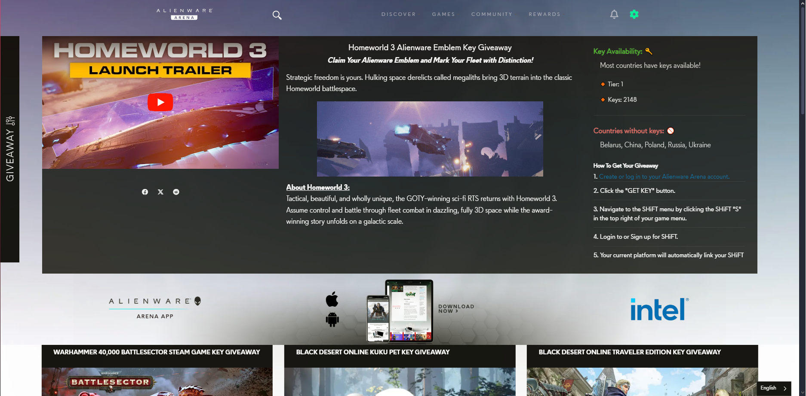
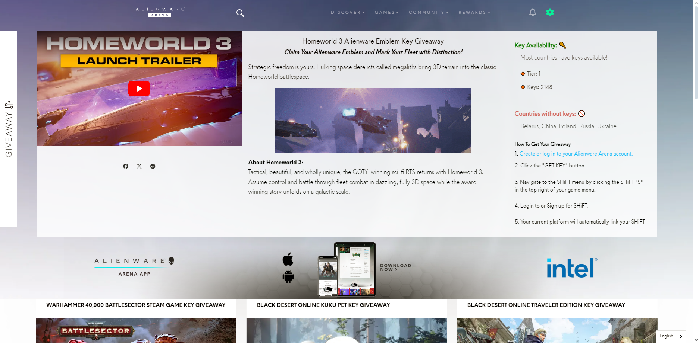
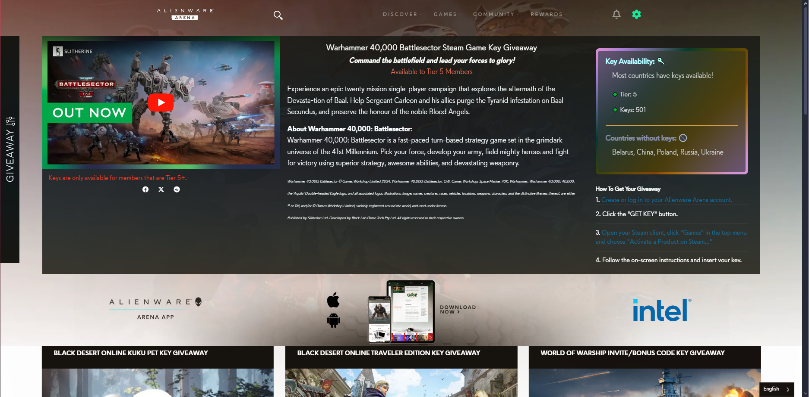
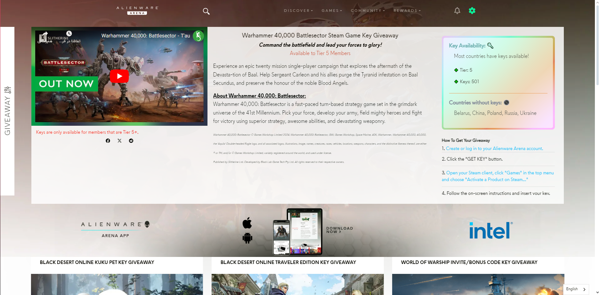

# AWA Key Checker
This userscript tell you the current amount of keys, level/tier requirements and restrictions for Alienware Arena giveaways. Give it a look to see more information about GAs, and to see if keys are available in your region.

It will work when you are on an an Alienware Arena giveaway page. Also you can enable RGB feature in settings!

## How to use
1. _Install_ a userscript manager extension like [Tampermonkey](https://chromewebstore.google.com/detail/nbhcbdghjpllgmfilhnhkllmkecfmpld) / [Violentmonkey](https://chromewebstore.google.com/detail/violentmonkey/jinjaccalgkegednnccohejagnlnfdag) or [Greasemonkey](https://addons.mozilla.org/en-US/firefox/addon/greasemonkey)\
or literally any monkey that exist :smiley:
2. _Open_ <a href="https://github.com/amoAR/AWA-Key-Checker/blob/main/AWACheck.user.js" target="_blank">This</a> link & install! :tada:
3. _Take a look_ at [Alienware](https://eu.alienwarearena.com/ucf/Giveaway) :sunglasses:

## Screenshots

<table>
    <thead>
        <th>
             
            

                Dark mode
            

             
        </th>
        <th>
             
            
Light mode

             
        </th>
    </thead>
    <tbody>
        <tr>
            <td>
                
Default:

                
            </td>
            <td>
                
Default:

                
            </td>
        </tr>
        <tr>
            <td>
                
RGB:

                
            </td>
            <td>
                
RGB:

                
            </td>
        </tr>
        <tr>
            <td colspan=2>
                
<pre align="center">No keys!</pre>

                
            </td>
        </tr>
    </tbody>
</table>

## License

> Checking key availability is based on [Saulios](https://github.com/Saulios/awa_key_checker) project.\
&copy; 2024 <a href="https://github.com/amoAR">amoAR</a> | Licensed under the <a href="https://github.com/amoAR/AWA_Key_Checker/blob/main/LICENSE">MIT license</a>.