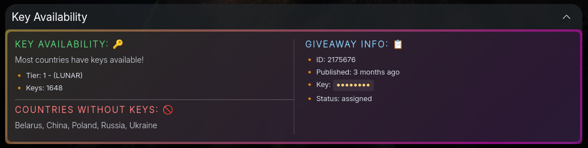

# AWA Key Checker
This userscript tell you the current amount of keys, level/tier requirements and restrictions for Alienware Arena giveaways. Give it a look to see more information about GAs, and to see if keys are available in your region.

It will work when you are on an Alienware Arena giveaway page. Also you can enable RGB feature in settings!

## How to use
1. __Install__ a userscript manager extension like [Tampermonkey](https://chromewebstore.google.com/detail/nbhcbdghjpllgmfilhnhkllmkecfmpld) / [Violentmonkey](https://chromewebstore.google.com/detail/violentmonkey/jinjaccalgkegednnccohejagnlnfdag) or [Greasemonkey](https://addons.mozilla.org/en-US/firefox/addon/greasemonkey)\
_Or literally any monkey that exists_ :smiley:
2. __Open__ <a href="https://github.com/amoAR/AWA-Key-Checker/raw/main/AWACheck.user.js" target="_blank">This</a> link & click install! :tada:
3. __Take a look__ at [Alienware](https://eu.alienwarearena.com/ucf/Giveaway) :sunglasses:

## Screenshots

<table>
    <tbody>
        <tr>
            <td>
                
It will be placed under the GA:

                
            </td>
        </tr>
    </tbody>
</table>

## License

> Checking key availability is based on [Saulios](https://github.com/Saulios/awa_key_checker) project.\
&copy; 2024 <a href="https://github.com/amoAR">amoAR</a> | Licensed under the <a href="https://github.com/amoAR/AWA_Key_Checker/blob/main/LICENSE">GPL-3.0</a> license.
